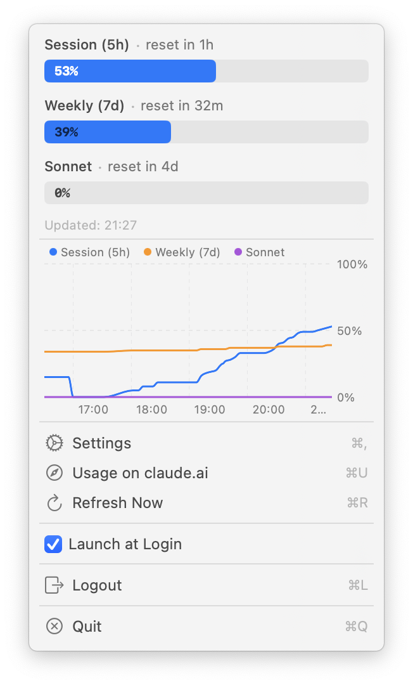

# ClaudeUsage — macOS Menu Bar Utility

A macOS menu bar app that shows your claude.ai subscription usage and rate limits at a glance.

## Screenshots




## Features

- **Menu bar icon** with configurable label (percentage, reset time, or both)
- **Inline usage chart** in the menu dropdown (selectable time period)
- **Usage history** stored locally in SQLite (90-day retention)
- **Two login methods**: built-in WebView or browser cookie import (for SSO users)
- **Launch at Login** support
- Session cookies stored securely in macOS Keychain

## Prerequisites

- macOS 15.0+
- Xcode 16+
- [XcodeGen](https://github.com/yonaskolb/XcodeGen): `brew install xcodegen`

## Setup

```bash
# Clone the repo
git clone https://github.com/posalex/ClaudeUsage.git
cd ClaudeUsage

# Generate the Xcode project
xcodegen generate

# Open in Xcode
open ClaudeUsage.xcodeproj
```

In Xcode:
1. Select the **ClaudeUsage** target → Signing & Capabilities
2. Set your **Development Team**
3. Select the **ClaudeUsage** scheme and press **⌘R**

## Usage

On first launch the app opens a window to log in. Choose either:
- **Sign in here** — log in directly via an embedded WebView
- **Import from browser** — paste cookies from your browser's dev tools (useful for SSO)

Once authenticated, the window closes and the app runs as a menu-bar-only utility (sparkle icon). Click the icon to see usage bars, toggle display options, and optionally show a usage chart.

To reopen the main window, click **Open Claude Usage** in the menu dropdown (or press ⌘O).

## Architecture

```
┌──────────────────────────┐
│    ClaudeUsage App       │
│                          │
│  ┌────────────────────┐  │
│  │ Menu Bar (sparkle) │  │   ← always visible
│  │  • Usage bars      │  │
│  │  • Inline chart    │  │
│  │  • Display toggles │  │
│  └────────────────────┘  │
│                          │
│  ┌────────────────────┐  │
│  │ Main Window        │  │   ← hidden when logged in
│  │  • Login sheet     │  │
│  │  • Dashboard       │  │
│  │  • Full chart      │  │
│  │  • Settings        │  │
│  └────────┬───────────┘  │
│           │              │
│  ┌────────▼───────────┐  │
│  │  UsageFetcher      │  │   ← timer-based, configurable interval
│  │  (cookies→Keychain)│  │
│  └────────┬───────────┘  │
│           │              │
│  ┌────────▼───────────┐  │
│  │  SQLite History    │  │   ← ~/Library/Application Support/ClaudeUsage/
│  └────────────────────┘  │
└──────────────────────────┘
```

## Configuration

- **Refresh interval**: 1–30 minutes (Settings in main window)
- **Menu bar label**: toggle session %, reset time, weekly %, Sonnet % (menu dropdown checkboxes)
- **Inline chart period**: Off, 1H, 5H, 1D, 1W, 1M, 3M, 1Y, All

## Install via Homebrew

```bash
brew tap posalex/tap
brew install --cask claude-usage
```

The app is not notarized, so macOS will block it on first launch. Remove the quarantine flag to allow it:

```bash
xattr -d com.apple.quarantine /Applications/ClaudeUsage.app
```

## Makefile

| Target | What it does |
|--------|-------------|
| `make build` | Generate Xcode project and build Release |
| `make run` | Build Debug and launch the app |
| `make clean` | Remove build artifacts and generated .xcodeproj |
| `make release` | Push, tag, wait for CI, update the tap — the full pipeline |
| `make update-tap` | Just update the tap SHA (if release already exists) |
| `make install` | `brew tap` + `brew install` + remove quarantine |
| `make reinstall` | Fresh tap + reinstall + remove quarantine |

Bump the version with `make release VERSION=1.1.0`.

## License

GPL-3.0